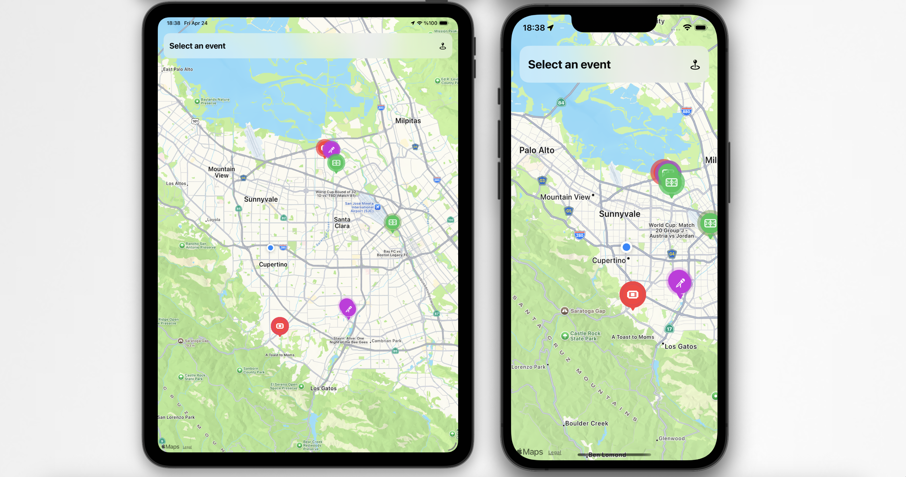
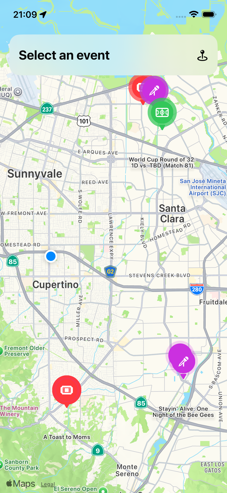
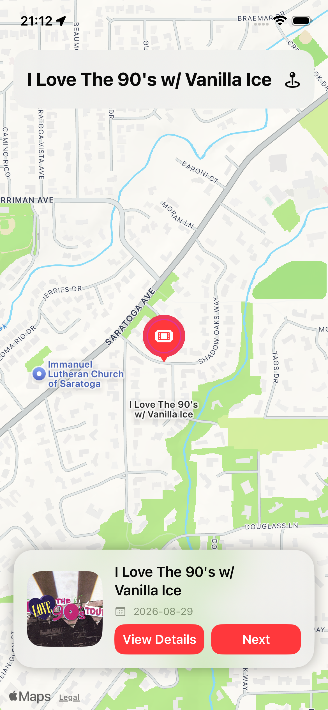
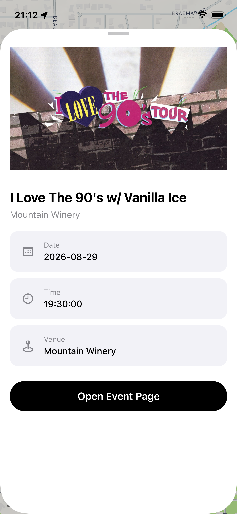

# Evently — Harita Tabanlı Etkinlik Keşif Uygulaması

  

  <strong>Yakındaki etkinlikleri keşfet. Haritada anında gör.</strong>

  
  
  
  
  

---

## Hakkında

**Evently**, SwiftUI ile geliştirilmiş modern bir iOS harita uygulamasıdır. Kullanıcının konumunu alır ve çevresindeki etkinlikleri harita üzerinde gerçek zamanlı olarak gösterir.

Uygulama, etkinlik verilerini Ticketmaster API üzerinden çeker ve kullanıcıya konum bazlı keşif deneyimi sunar.
Scre

- **Konum bazlı keşif** — Kullanıcının bulunduğu konuma göre etkinlikler
- **Gerçek zamanlı veri** — API üzerinden canlı etkinlik akışı
- **Harita deneyimi** — Etkinlikleri doğrudan map üzerinde görüntüleme
- **Minimal ve hızlı** — Sade arayüz + performans odaklı yapı
- **Modern iOS mimarisi** — SwiftUI + MVVM

---

## Ekran Görüntüleri

  
  
  

---

## Özellikler

### Harita — Ana Ekran
- Kullanıcının anlık konumu haritada gösterilir
- Yakındaki etkinlikler pin (annotation) olarak işaretlenir
- Harita hareket ettikçe yeni etkinlikler yüklenir
- Custom annotation view ile görsel iyileştirme

### Etkinlik Önizleme
- Harita üzerinde seçilen etkinlik alt kartta gösterilir
- Etkinlik adı, tarih ve kısa bilgi
- Detay sayfasına geçiş

### Etkinlik Detayı
- Etkinlik görseli ve detaylı açıklama
- Lokasyon bilgisi (venue + city)
- Etkinlik linki ile dış kaynağa yönlendirme

---

## Mimari

Proje, **MVVM + Service Layer** mimarisi kullanılarak geliştirilmiştir.

